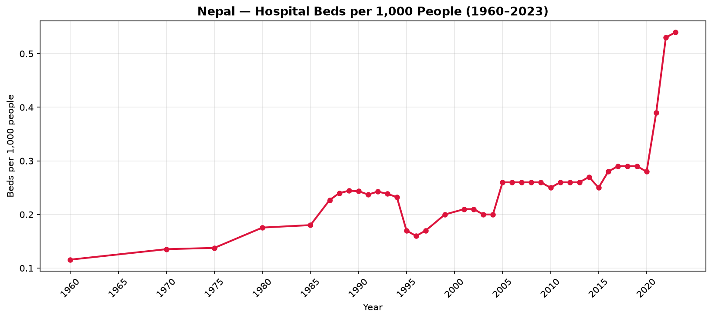
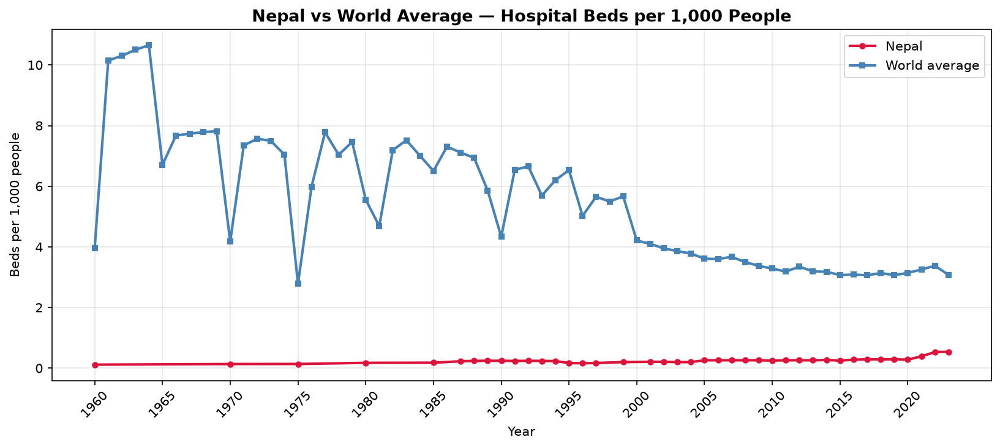
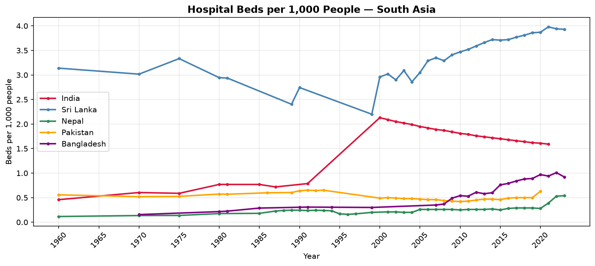
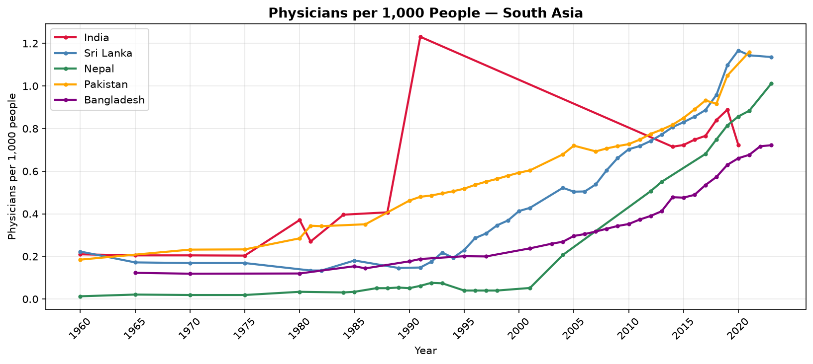
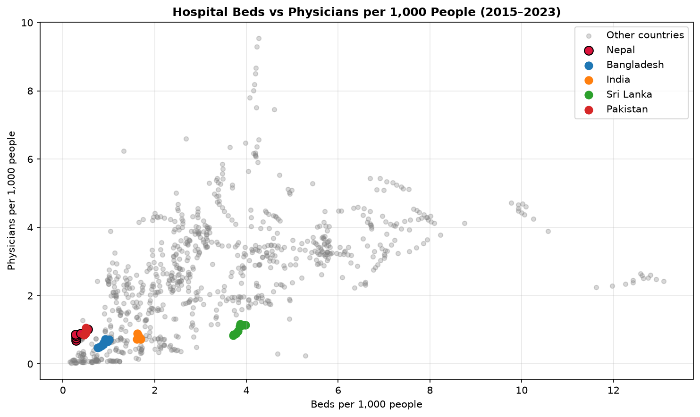
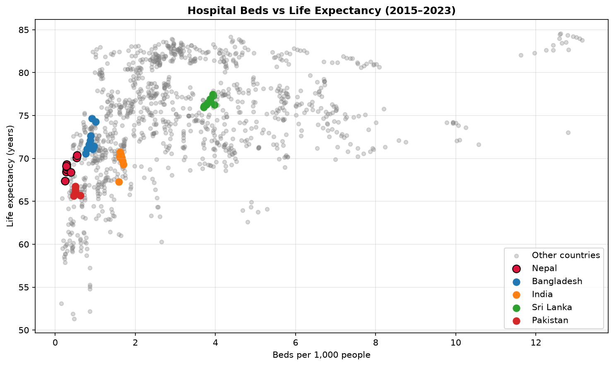
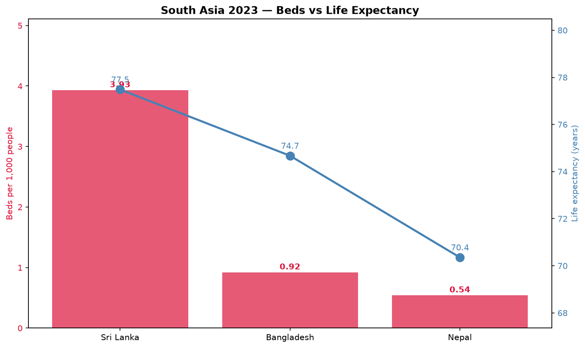

# Nepal Health Analysis 🏥

An end-to-end SQL + Python analysis of Nepal's healthcare access — hospital beds, 
physicians, and life expectancy — compared against the world and South Asia.

Built with SQLite, Python (pandas, matplotlib, seaborn), and Jupyter.

---

## 📊 Key Findings

- Nepal's hospital beds grew from **0.12** to **0.54 per 1,000 people** between 1960 and 2023 — a **4.5x increase**, yet still far below the global average.
- Nepal has roughly **5.7x fewer hospital beds** than the world average (0.54 vs 3.08 per 1,000).
- Nepal trails South Asian peers: **Sri Lanka has 3.93 beds per 1,000** — over **7x more** than Nepal's 0.54.
- Nepal's life expectancy (70.4 years) is only **4.9 years below the world average** (75.2), despite the massive bed shortage — suggesting other factors shape health outcomes.
- Sri Lanka stands out as the South Asian success story: **3.93 beds per 1,000 and 77.5 years** of life expectancy, both above the world average.

> **Data note:** India and Pakistan were excluded from the 2023 comparison due to missing data in the World Bank dataset for that year.
---

## 📈 Visuals

### 1. Nepal's Hospital Beds Over Time (1960–2023)


### 2. Nepal vs World Average


### 3. South Asia — Hospital Beds


### 4. South Asia — Physicians


### 5. Beds vs Physicians (2015–2023)


### 6. Beds vs Life Expectancy (2015–2023)


### 7. South Asia Snapshot — 2023


---

## 🗄️ Database & Methods

**Data source:** World Bank Open Data — three indicators for all countries, 1960–2023:
- Hospital beds per 1,000 people
- Physicians per 1,000 people
- Life expectancy at birth

**Database:** SQLite (`data/nepal_health.db`) with three tables:

| Table | Rows | Description |
|---|---|---|
| `beds` | 4,801 | Hospital beds per 1,000 (country-year) |
| `physicians` | 5,367 | Physicians per 1,000 (country-year) |
| `life_expectancy` | 14,266 | Life expectancy in years (country-year) |

**Approach:**
1. Loaded raw World Bank CSVs (wide format)
2. Reshaped to long format (one row per country-year)
3. Filtered out regional aggregates (kept only real countries)
4. Loaded into SQLite
5. Queried with SQL (joins, aggregations, filters)
6. Visualized with matplotlib + seaborn

---

## 🧠 Skills Demonstrated

- **SQL** — JOINs across 3 tables, GROUP BY aggregation, filtering, sorting
- **Database design** — SQLite schema, table relationships, data integrity
- **Python** — pandas for data transformation, matplotlib/seaborn for visualization
- **Data storytelling** — turning numbers into a clear narrative about health inequality

---

## 🚀 How to Run

```bash
# clone the repo
git clone https://github.com/baibhavojha2008-tech/nepal-health-analysis.git
cd nepal-health-analysis

# open the notebook
jupyter notebook notebooks/nepal_health_analysis.ipynb
